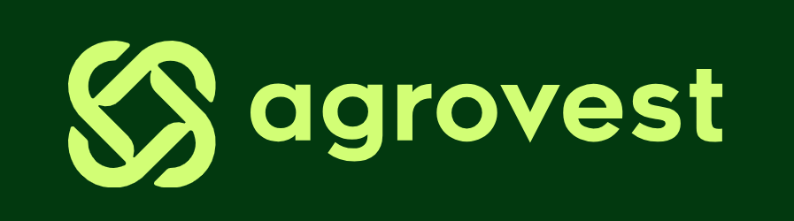
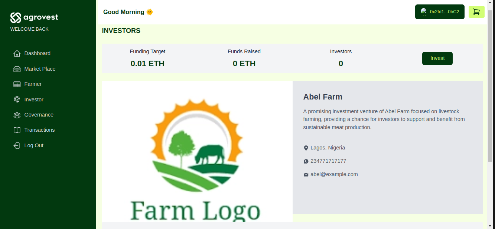
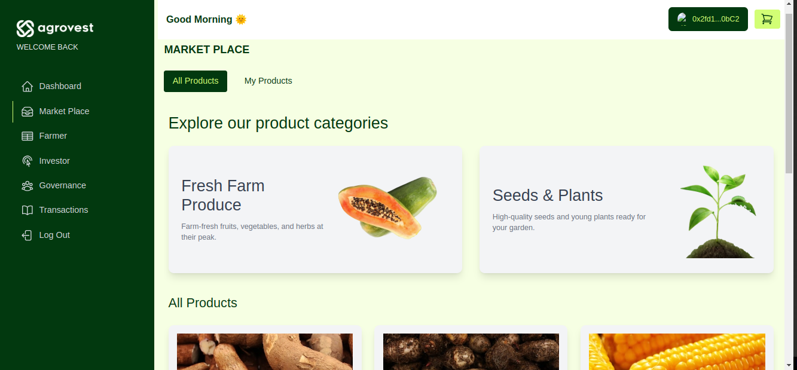
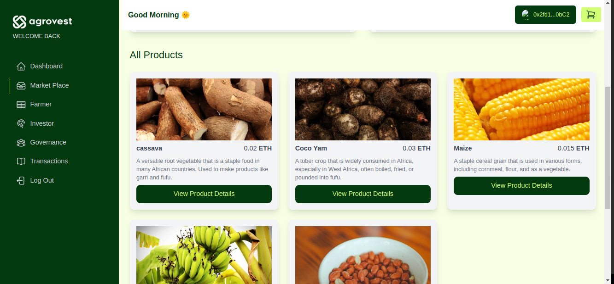
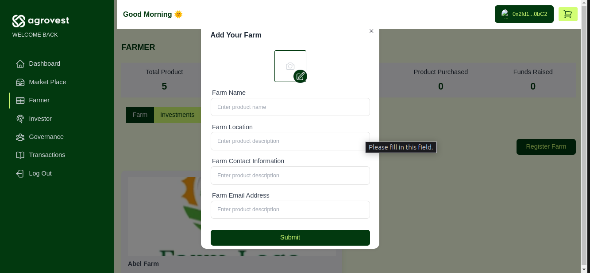
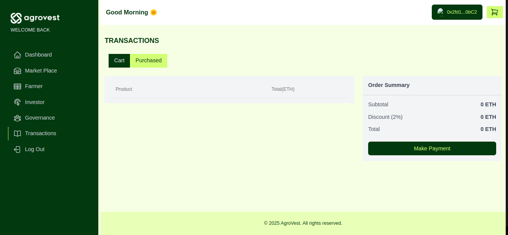

<!-- Improved compatibility of back to top link: See: https://github.com/othneildrew/Best-README-Template/pull/73 -->

<!--
*** Thanks for checking out the Best-README-Template. If you have a suggestion
*** that would make this better, please fork the repo and create a pull request
*** or simply open an issue with the tag "enhancement".
*** Don't forget to give the project a star!
*** Thanks again! Now go create something AMAZING! :D
-->

<!-- PROJECT SHIELDS -->
<!--
*** I'm using markdown "reference style" links for readability.
*** Reference links are enclosed in brackets [ ] instead of parentheses ( ).
*** See the bottom of this document for the declaration of the reference variables
*** for contributors-url, forks-url, etc. This is an optional, concise syntax you may use.
*** https://www.markdownguide.org/basic-syntax/#reference-style-links
-->

<!-- PROJECT LOGO -->
 

  

  

    AgroVest is a Real World Asset platform that empowers African farmers by tokenizing their farm business, helping them sell products directly to consumers, and securing investments opportunities to enable them grow their farm.

<!-- GETTING STARTED -->

## Inspiration

African farmers face challenges such as lack of access to capital, market inefficiencies, and limited opportunities for growth. Agro Vest addresses these issues by providing a platform where farmers can showcase their products, attract investment, and build long-term partnerships with backers who are genuinely interested in the success of their farms.

## Problems

Agriculture in Africa faces several significant challenges

**1. Limited Access to Finance:** African farmers struggle to get loans and financial services because they lack credit history and collateral. Banks see them as high-risk borrowers.

**2. Market Access:** Farmers rely on middlemen and often don't know fair market prices, leading to lower profits for them. They struggle to find consumers who would buy directly from them.

**3. Land Ownership Problems:** Many farmers don't have clear proof of land ownership, leading to disputes and making it hard to use land as loan collateral, and in some cases they lose ownership of the land.

**4. Poor Supply Chain Management:** Farmers can't track their products once they leave the farm, leading to waste and quality issues.

## Solutions

**1. Limited Access to Finance:**

The investment feature of Agro Vest aims to empower African farmers and revolutionize the agricultural sector. It enables investors to directly fund farmers' projects, fostering a mutually beneficial partnership that drives growth and sustainability.

  

 

**2a. Market Access:**

The Agro Vest marketplace serves as a digital hub where farmers can list their products. By joining the marketplace, farmers gain access to a global audience, allowing them to showcase their offerings and attract the attention of buyers from all over the world.

  

  

 

**2b. Diverse Product Listings**: Farmers can list a wide range of products, from fresh produce and livestock to value-added goods like dairy products, organic fertilizers, and artisanal items. This diversity allows farmers to reach different market segments, enhancing their sales opportunities and expanding their customer base.

  

  

   

**3. Land Ownership Problems:**
Agro Vest solves land ownership challenges by leveraging blockchain technology to tokenize farmland, providing a secure and transparent digital proof of ownership. This ensures that land records are tamper-proof, reducing disputes and fraud.

  

  

   

**4. Poor Supply Chain Management:** Agro Vest solves supply chain inefficiencies by leveraging blockchain technology to create a transparent and traceable agricultural network. This ensures that every stage of the supply chain, from production to delivery, is securely recorded on-chain, reducing fraud and improving accountability.

 

  

   

<!-- ## How We Built It

- **Solidity Smart Contracts**
- **Scaffold ETH**
- **Optimisim**
- **The Graph**
- **Next Js**

## Challenges We Ran Into

- **Circles**::
- **The Graph**:
- **Scaffold ETH**: -->

## Smart Contract

[MarketPlace](https://example.com)
 

[Investment](https://example.com)
 
 
[DAO](https://example.com)
[Escrow](https://example.com)

<!-- ROADMAP -->

## Roadmap

- Insurance Setup For Both Farmers and Investors
- Supply Chain Setup
- Full Account Abstraction

<!-- CONTACT -->

## Contact

Abel Osaretin - [@DevWizard\_](https://x.com/DevWizard_) - contact.abel321@gmail.com

<!-- ACKNOWLEDGMENTS -->

## Acknowledgments

- [Banwo Olorunsogo](https://github.com/sogobanwo)

(<a href="#readme-top">back to top</a>)

<!-- MARKDOWN LINKS & IMAGES -->
<!-- https://www.markdownguide.org/basic-syntax/#reference-style-links -->

[contributors-shield]: https://img.shields.io/github/contributors/github_username/repo_name.svg?style=for-the-badge
[contributors-url]: https://github.com/github_username/repo_name/graphs/contributors
[forks-shield]: https://img.shields.io/github/forks/github_username/repo_name.svg?style=for-the-badge
[forks-url]: https://github.com/github_username/repo_name/network/members
[stars-shield]: https://img.shields.io/github/stars/github_username/repo_name.svg?style=for-the-badge
[stars-url]: https://github.com/github_username/repo_name/stargazers
[issues-shield]: https://img.shields.io/github/issues/github_username/repo_name.svg?style=for-the-badge
[issues-url]: https://github.com/github_username/repo_name/issues
[license-shield]: https://img.shields.io/github/license/github_username/repo_name.svg?style=for-the-badge
[license-url]: https://github.com/github_username/repo_name/blob/master/LICENSE.txt
[linkedin-shield]: https://img.shields.io/badge/-LinkedIn-black.svg?style=for-the-badge&logo=linkedin&colorB=555
[linkedin-url]: https://linkedin.com/in/linkedin_username
[product-screenshot]: images/screenshot.png
[Next.js]: https://img.shields.io/badge/next.js-000000?style=for-the-badge&logo=nextdotjs&logoColor=white
[Next-url]: https://nextjs.org/
[React.js]: https://img.shields.io/badge/React-20232A?style=for-the-badge&logo=react&logoColor=61DAFB
[React-url]: https://reactjs.org/
[Vue.js]: https://img.shields.io/badge/Vue.js-35495E?style=for-the-badge&logo=vuedotjs&logoColor=4FC08D
[Vue-url]: https://vuejs.org/
[Angular.io]: https://img.shields.io/badge/Angular-DD0031?style=for-the-badge&logo=angular&logoColor=white
[Angular-url]: https://angular.io/
[Svelte.dev]: https://img.shields.io/badge/Svelte-4A4A55?style=for-the-badge&logo=svelte&logoColor=FF3E00
[Svelte-url]: https://svelte.dev/
[Laravel.com]: https://img.shields.io/badge/Laravel-FF2D20?style=for-the-badge&logo=laravel&logoColor=white
[Laravel-url]: https://laravel.com
[Bootstrap.com]: https://img.shields.io/badge/Bootstrap-563D7C?style=for-the-badge&logo=bootstrap&logoColor=white
[Bootstrap-url]: https://getbootstrap.com
[JQuery.com]: https://img.shields.io/badge/jQuery-0769AD?style=for-the-badge&logo=jquery&logoColor=white
[JQuery-url]: https://jquery.com
